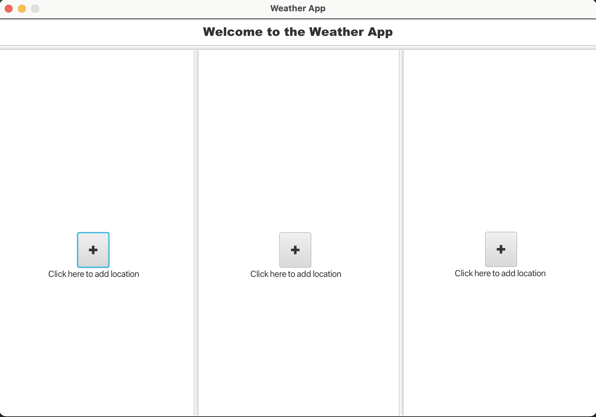
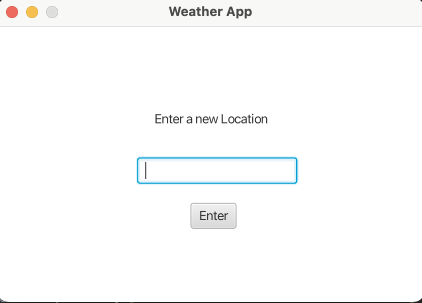
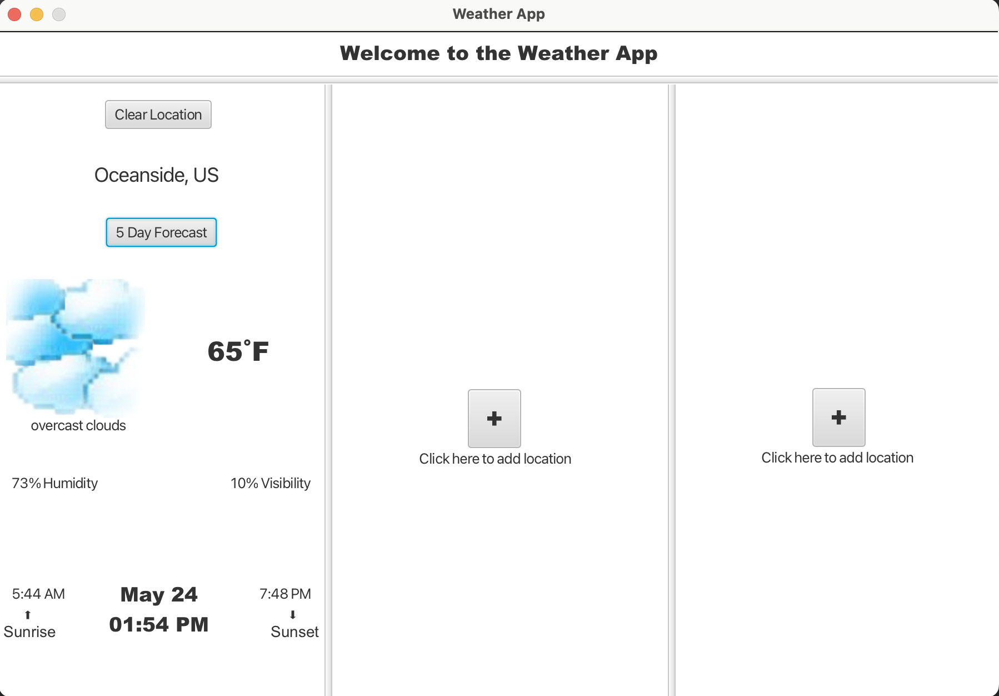

# cs-210-final-project
## AUTHORS
 * David Jordan
 * Joshua Clemens

## Project Description
A simple weather app that allows the user to view 3 locations at once.
They will also be able to view:
* Sky Conditions
* 5-Day Forecast
* Sunset and Sunrise
* Humidity
* Visibality

 ## Screenshots
 * Main menu 
 
 
 * Add Location 
 
 
  * Added a Location 
 

